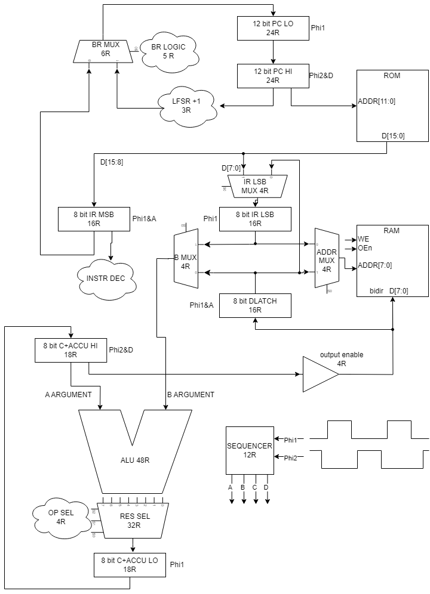
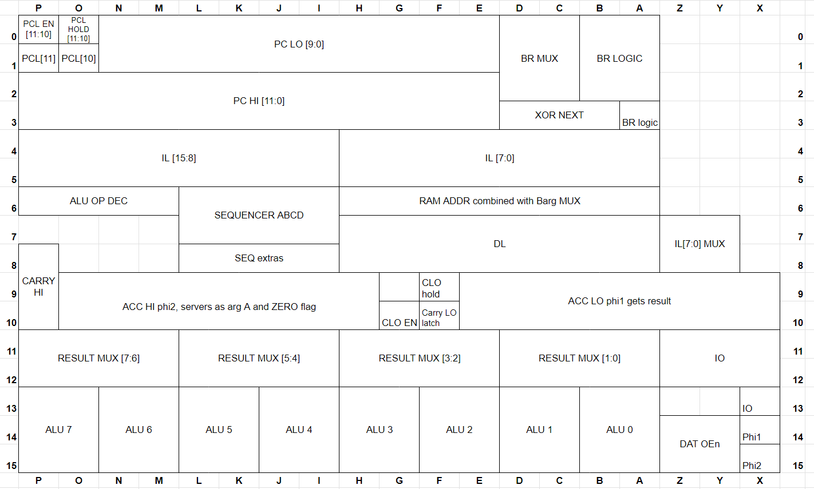

# 8 bit relay CPU 
Here you will find a dump of everything related to my homemade 8 bit relay processor that has been in the making since 2017 in its 4th reincarnation.
If you ever think of doing something similar, please check out [my tips](#Tips)

Quick facts: 
* Harvard architecture with 4096 16bit instructions
* 256 bytes of RAM (more with paging)
* Whopping 10 Hz clock speed
* Accumulator with Carry and Zero flags
* 3 Adressing modes: immediate, absolute and relative
* 297 DPDT relays mounted on a wooden frame
* 7.5 kg weight

[Youtube short with a test program running so you can hear it](https://youtube.com/shorts/OLjjTxIbFqM?si=LqGwUwT4EK45KLl0)

Current status: Program counter and instruction fetch are done, parts of ALU are also done. 
Up next: sorting stability issues.

## Main Diagram

## Front 
The plexiglass at the front adds stability to the whole build. Bus wiring is mostly done in front to free up the routing space in the back and also for aesthetic reasons.

## Back 
Cable salad :)

## Control Board 
The control board emulates ROM and RAM, drives clock and reset, with an added benefit of serving as a debug device, sending execution trace to host PC.
Also doing memory mapped IO is easy, as the MCU on board can easily intrecept and interpret writes to certain memory adresses as special (i.e. output, halt, random number, etc.)
This board makes the CPU even more useless, as the MCU on board also interprets the code to serve as a checker, comparing expected execution results with the interpreter.

## Layout
Since the build is not finished yet, a lot of places are unallocated.

## Digital Sim 
A screenshot of an included implementation (partial) in [Digital](https://github.com/hneemann/Digital)

# Instruction Set and Architecture
later :) 

# Tips 
If you dream of an electromechanical device capable of computation and you find relay clacking noises fascinating and think of making a CPU?
Please don't. Utterly useless endeavour.
But if you are serious, then please consider following points that I have painstakingly found out in last ~14 years in trying to make this project a reality

1. Socket your relays. They will fail, I promise. If you solder them in, you will have a bad time.
2. LEDs everywhere! Not only it looks cool, but it makes debugging that much easier. And you will have to debug - faulty relays, broken connections, wrong connections, race/timing issues, etc.
3. Do a PCB or solder wires directly. I already commited to a screw driven connection and I loathe it every second, as such connections are seriously unstable, especially if you splice multiple wires under a single screw.
4. Don't do relay memory for ROM/RAM. Just a huge waste of time.
5. Don't use EPROM and RAM chips, emulate them. The control board
6. Using diodes is cheating
7. Using capacitors is almost cheating :)
8. Do small scale tests before you commit to big work packages. Oh boy how many times I've burned myself with this.

# Whats in here
* asm.py is a homebrew macro assembler with inlining and local vars and an interpreter
* top.dig - behavioral schematic for Digital simulator (can load hex files produced by asm)
# Whats not here
* MBED firmware that reads data
* control board schematic (there never was one)
