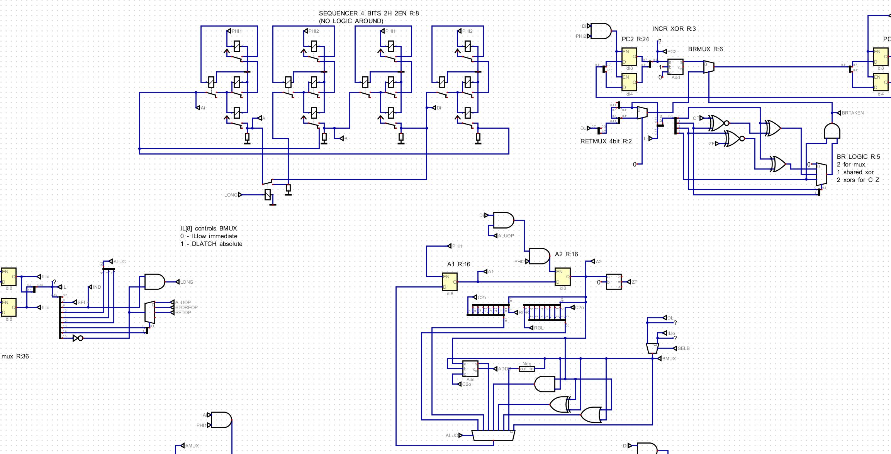

# 8 bit relay CPU 
Here you will find a dump of everything related to my homemade 8 bit relay processor that has been in the making since 2017 in its 4th reincarnation.
If you ever think of doing something similar, please check out [my tips](#Tips)

Quick facts: 
* Harvard architecture with 4096 16bit instructions
* 256 bytes of RAM (more with paging)
* Whopping 10 Hz clock speed, most instructions taking 2 cycles
* 8 bit Accumulator register with Carry and Zero flags
* 3 Adressing modes: immediate, absolute and relative
* 297 DPDT socketed relays mounted on a wooden frame with individual LED
* 7.5 kg weight

[Youtube short with a test program running so you can hear it](https://youtube.com/shorts/OLjjTxIbFqM?si=LqGwUwT4EK45KLl0)

Current status: Program counter and instruction fetch are done, parts of ALU are also done.  
Up next: sorting out reliability issues.  

## Main Diagram

## Front 
The plexiglass at the front adds stability to the whole build. Bus wiring is mostly done in front to free up the routing space in the back and also for aesthetic reasons.

## Back 
Main star of the routing is the PCB screw connector (blue part) with 8 connections for each relay. Upper left screw terminal is (mostly, with few exceptions) ground for the coil (vertical lines extending from the lower horizontal wire on the frame). Upper right is the coil control. Then two sides for DPDT.
Wiring is very tedious, because each end has to be ferruled, or the wire will fall out of the connector.

## Control Board 
The control board emulates ROM and RAM, drives clock and reset, with an added benefit of serving as a debug device, sending execution trace to host PC.
Also doing memory mapped IO is easy, as the MCU on board can easily intrecept and interpret writes to certain memory adresses as special (i.e. output, halt, random number, etc.)
This board makes the CPU even more useless, as the MCU on board also interprets the code to serve as a checker, comparing expected execution results with the interpreter.

## Layout
Since the build is not finished yet, a lot of places are unallocated. PCL bits 11 and 10 illustrate how all latches are implemented. 1 Relay is the latch, 1/2 of a relay is data-enable and 1/2 is for holding/resetting the latch.

## Digital Sim 
A screenshot of an included implementation (partial) in [Digital](https://github.com/hneemann/Digital)

# Instruction Set and Architecture
There is only 1 usable register - accumulator.   

There are only 3 types of instructions - ALU instructions, Branches (conditional upon carry and zero and unconditional), Store.   

There is no **call** instruction, no subroutines (can be added with only 4 relays, but its useless anyway) - with the help of assemlber, all subroutines are inlined.  

ALU instructions: ADDC (A+B+Carry), load (move B arg to A), AND, OR, XOR, NOTA, ROR(with carry), ROL (with carry)
All other useful instructions (i.e. sub or clc) are done via macros.

	.def clc  ; to clear carry we just rotate a 0
		lda #0
		rol
	.end

	.def sub b
		.local t
		.local t2
		sta $t ;save acc to temp var
		lda b
		not
		add #1  
 		sta $t2 ;do 2s complement of sub arg and save it
		clc     ;this is a macro that will be expanded in place
		lda $t2
		add $t ; -b + a
	.end

# Tips 
You dream of an electromechanical device capable of computation and you find relay clacking noises fascinating and think of making a CPU?  

Please don't. Utterly useless endeavour.  

But if you are serious, then please consider following points that I have painstakingly found out in last ~14 years in trying to make this project a reality

1. Socket your relays. They will fail, I promise. If you solder them in, you will have a bad time.
2. LEDs everywhere! Not only it looks cool, but it makes debugging that much easier. And you will have to debug - faulty relays, broken connections, wrong connections, race/timing issues, etc.
3. Do a PCB or solder wires directly. I already commited to a screw driven connection and I loathe it every second, as such connections are seriously unstable, especially if you splice multiple wires under a single screw.
4. Don't do relay memory for ROM/RAM. Just a huge waste of time.
5. Don't use EPROM and RAM chips, emulate them with a microcontroller. Having such a fine control over IO would help a lot with bringup and debugging.
6. Using diodes is cheating, but you do you.
7. Using capacitors is almost cheating :) (but may be unavoidable in general to fix timing issues)
8. Do small scale tests before you commit to big work packages. I have done a lot of wiring only to find out that I made a huge conceptual mistake.
9. Do a test rig for you relays and characterize their timing - a lot of relays are either dead broken from the factory or have some crazy timings (i.e. 20ms rising time instead of 3ms).

# Whats in here
* asm.py - is a homebrew macro assembler with inlining, local vars, virtual stack and environments + an interpreter
* code.asm - a program of snake
* top.dig - behavioral schematic for Digital simulator (can load hex files produced by asm.py)

# Whats not here
* MBED firmware that reads data and interprets code
* control board schematic (there never was one)
